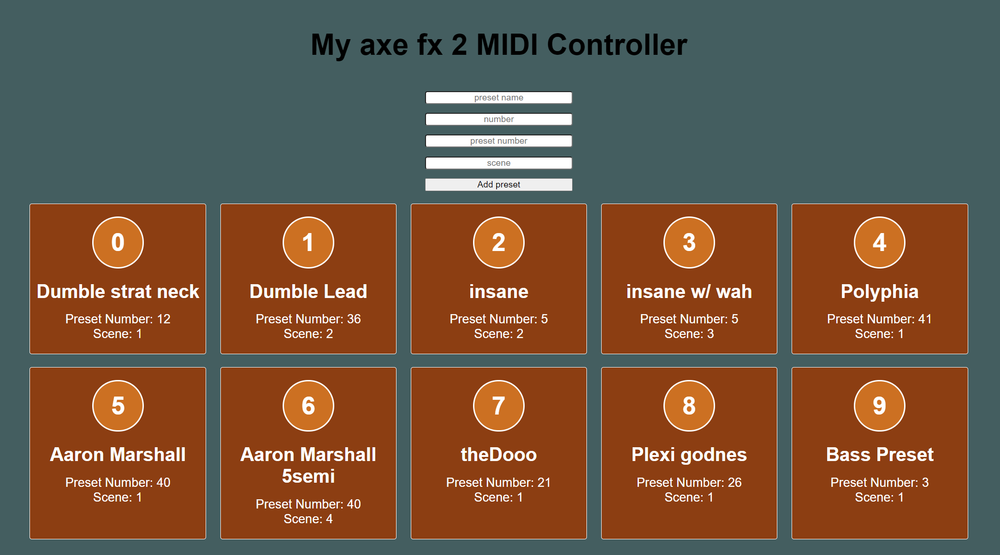

# 
 AXE FX 2 MIDI PROJECT

These program is a MIDI service that works with an axe fx 2 without buying a 1000$ midi foot controller. I have always wanted to utilize my axe fx midi capabilities of switching between presets fast mid-song, so I built my own 'browser midi controller'.

To run the app just download the project as a zip file extract the files and press the bat file to initiate. It will the a few seconds to download the necessary packages. keep in mind you need to have Node.js installed on you computer.
## 
 packages 

- These project was based around the <a href="https://github.com/djipco/webmidi/tree/develop">webmidi v3.0.0-alpha </a> npm which supports Node.js.

- Express server which has the main MIDI function call

- Front built with React

For now the DB with all the 10 presets sits in a JSON file, in order to change the presets go to the DB folder open the JSON file and change the preset name, preset number and the scene.

After all of you favorite presets are written down in the file save it and refresh the page.
I also made it possible to add presets via the inputs in the client, keep in mind that for now the presets can be assigned to buttons 0-9(10 presets overall).

After the setup is done in order to switch between the presets make sure your browser is open on http://localhost:8080/ and the page is open and active. When pressing a number on the keyboard the corresponding preset will be darker than the rest indicating its the active one.

I still have some styling to make but for now the functionality works and the preset changing is really fast and immediate which is what i aimed for 🤗. 
